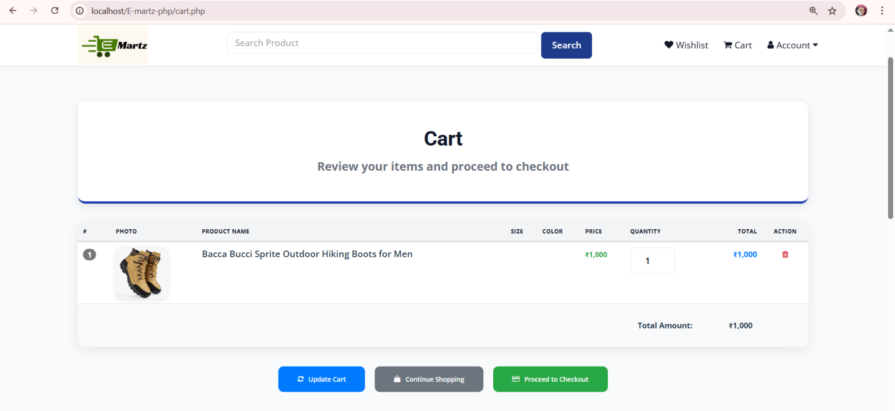
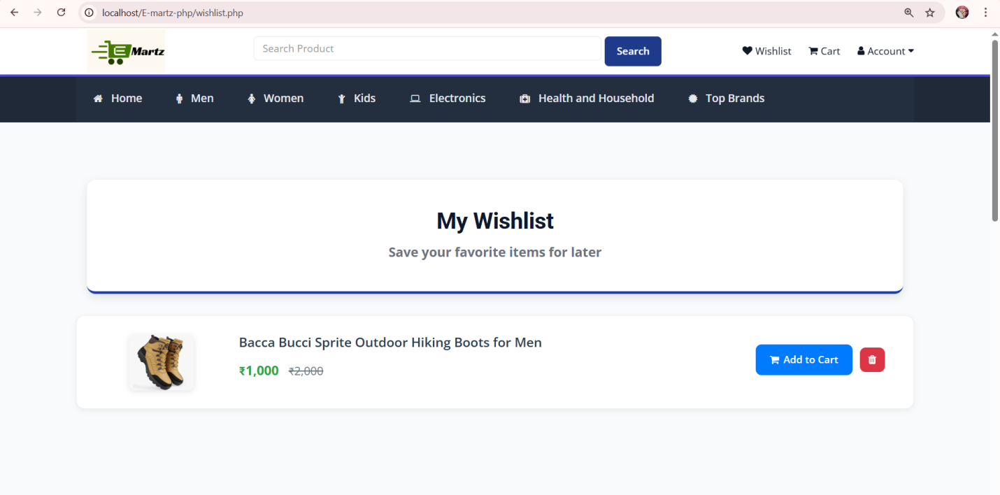

# E-Martz PHP E-commerce Website

A full-featured e-commerce website built with PHP, MySQL, and modern web technologies.

## Screenshots

### Homepage


### Product Categories


### Product Details


### Shopping Cart


### Customer Dashboard


### Wishlist


### Admin Dashboard


### Seller Dashboard


## Features

- User Authentication (Login/Register)
- Product Management
- Shopping Cart
- Order Management
- Admin Dashboard
- Seller Dashboard
- Product Categories
- Search Functionality
- Secure Checkout Process
- Order Tracking
- Wishlist Management
- User Profile Management

## Documentation

Detailed documentation is available in the `Documentation` folder:

- **E-MARTZ.pdf**: Comprehensive project documentation including:
  - System Architecture
  - Database Schema
  - Installation Guide
  - User Manual
  - Admin Guide
  - API Documentation
  - Security Features

- **E-MARTZ.pptx**: Project presentation with:
  - Project Overview
  - Features Showcase
  - Technical Architecture
  - Implementation Details
  - Future Enhancements

## Requirements

- PHP 7.4 or higher
- MySQL 5.7 or higher
- Apache Web Server
- XAMPP/WAMP/MAMP (for local development)

## Installation

1. Clone the repository:
   ```bash
   git clone https://github.com/YOUR_USERNAME/E-martz-php.git
   ```

2. Import the database:
   - Navigate to the `DATABASE FILE` directory
   - Import `ecommerceweb.sql` to your MySQL server

3. Configure the database connection:
   - Update the database credentials in the configuration files

4. Start your Apache and MySQL servers

5. Access the website through your web browser:
   ```
   http://localhost/E-martz-php
   ```

## Usage

### Admin Panel
- Access the admin panel at: `/admin`
- Manage products, categories, orders, and users
- View sales reports and analytics

### Seller Dashboard
- Sellers can register and manage their stores
- Add/edit products
- Manage orders and inventory
- Track sales and payments

### Customer Features
- Browse products by categories
- Add items to cart/wishlist
- Secure checkout process
- Track orders
- Manage profile and addresses

## Contributing

Contributions are welcome! Please feel free to submit a Pull Request.

## License

This project is licensed under the MIT License - see the LICENSE file for details.